# 🎨 Diagrammi Sistema - Dashboard e Ruoli

## Flusso Autenticazione e Routing

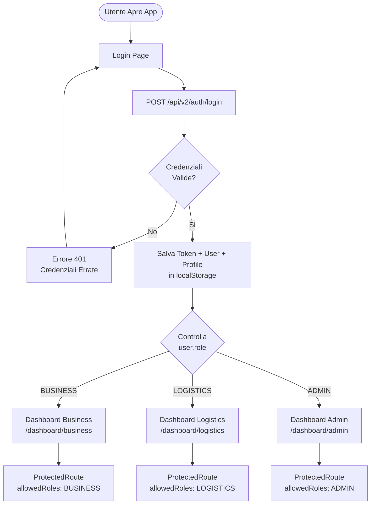

---

## Gerarchia Ruoli e Permessi

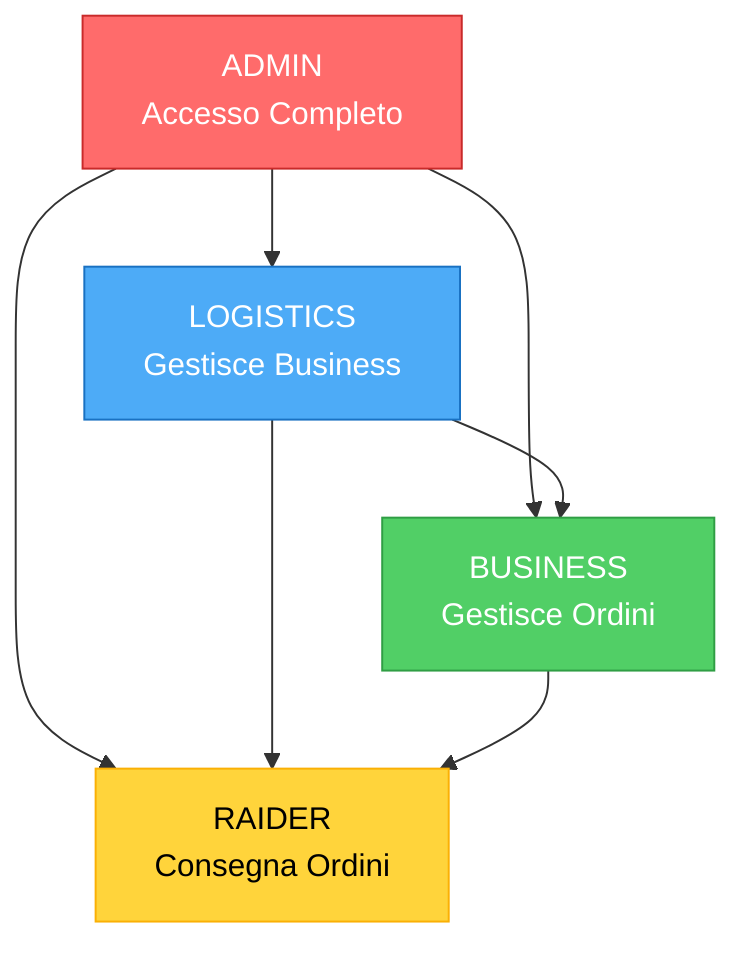

---

## Flusso Creazione Raider

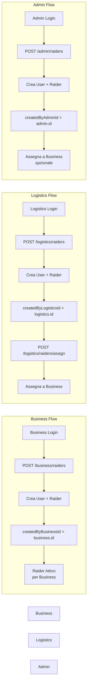

---

## Flusso Creazione Ordine

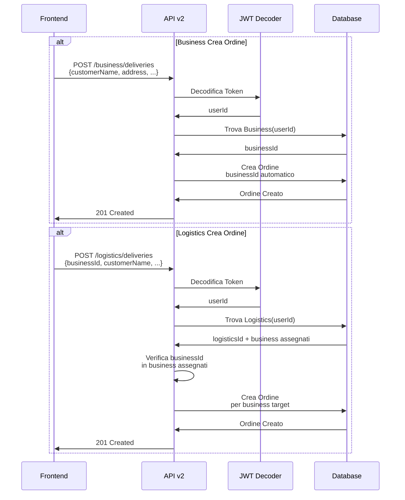

---

## Dashboard Business - Componenti

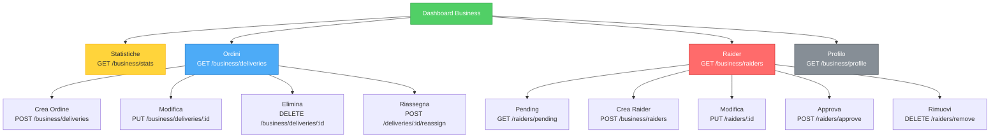

---

## Dashboard Logistics - Componenti

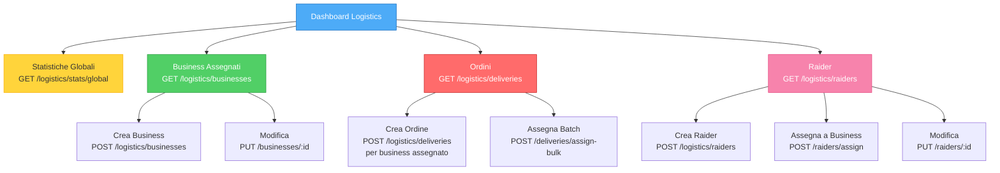

---

## Dashboard Admin - Componenti

```mermaid
graph TD
    DashA[Dashboard Admin] --> StatsA[Statistiche Sistema<br/>GET /admin/stats]
    DashA --> Users[Utenti<br/>GET /admin/users]
    DashA --> LogisticsA[Logistics<br/>GET /admin/logistics]
    DashA --> BusinessA[Business<br/>GET /admin/businesses]
    DashA --> RaidersA[Raider<br/>GET /admin/raiders]
    DashA --> OrdersA[Ordini Globali<br/>GET /admin/deliveries]
    
    Users --> ChangeRole[Cambia Ruolo<br/>PUT /users/:id/role]
    Users --> ToggleStatus[Attiva/Disattiva<br/>PUT /users/:id/status]
    
    LogisticsA --> AssignBiz[Assegna Business<br/>POST /logistics/assign-businesses]
    LogisticsA --> RemoveBiz[Rimuovi Business<br/>DELETE /logistics/remove-businesses]
    
    BusinessA --> CreateBizA[Crea Business<br/>POST /admin/businesses]
    BusinessA --> EditBizA[Modifica<br/>PUT /businesses/:id]
    BusinessA --> DeleteBizA[Elimina<br/>DELETE /businesses/:id]
    
    RaidersA --> CreateRaiderA[Crea Raider<br/>POST /admin/raiders<br/>per chiunque]
    RaidersA --> EditRaiderA[Modifica<br/>PUT /raiders/:id<br/>anche email]
    RaidersA --> ToggleRaider[Attiva/Disattiva<br/>PUT /raiders/:id/status]
    
    style DashA fill:#ff6b6b,stroke:#c92a2a,color:#fff
    style StatsA fill:#ffd43b,stroke:#fab005
    style Users fill:#868e96,stroke:#495057,color:#fff
    style LogisticsA fill:#4dabf7,stroke:#1971c2,color:#fff
    style BusinessA fill:#51cf66,stroke:#2f9e44,color:#fff
    style RaidersA fill:#f783ac,stroke:#e64980,color:#fff
    style OrdersA fill:#ff922b,stroke:#fd7e14,color:#fff
```

---

## Controllo Permessi

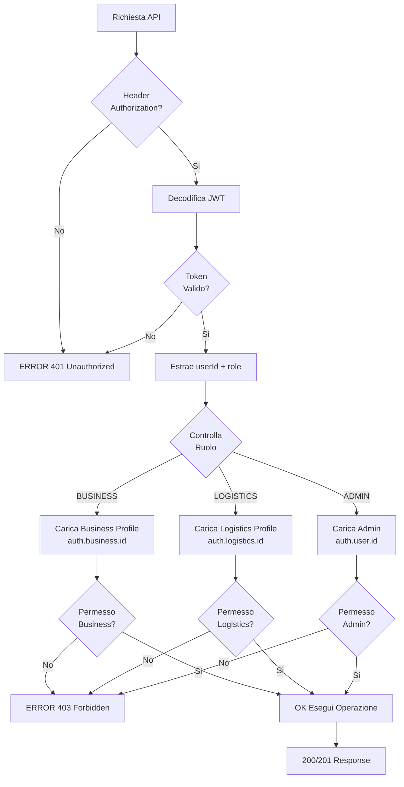

---

## Flusso Completo: Business Approva Raider

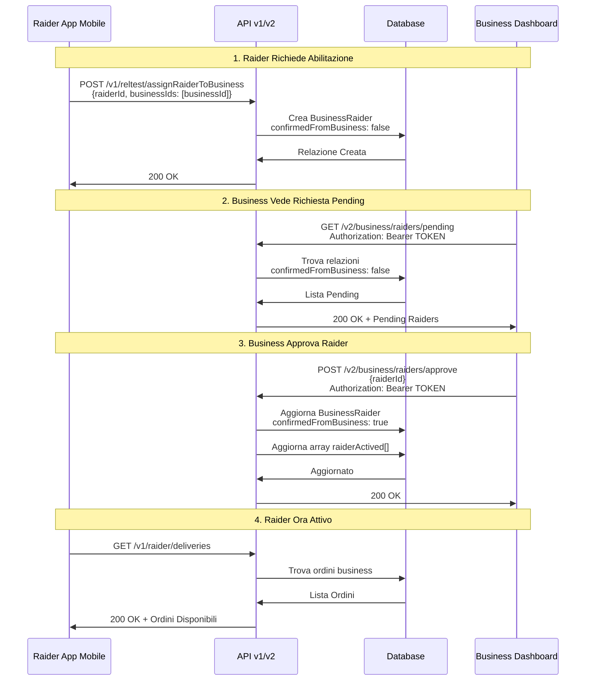

---

## Relazioni Database

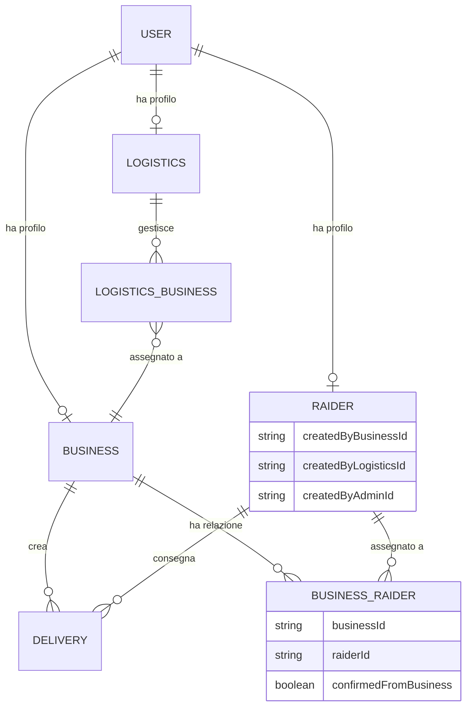

---

## Use Case: Logistics Crea e Assegna Raider

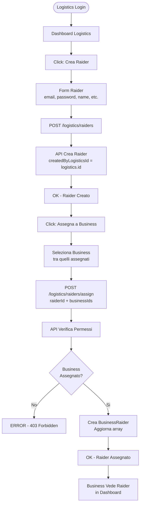

---

## Riepilogo Architettura

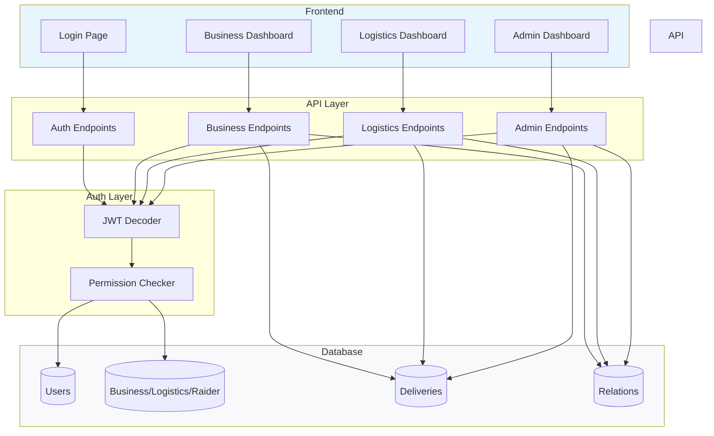

---

**Versione:** 2.0  
**Data:** 2025-10-02  
**Diagrammi:** Mermaid (compatibili con GitHub, GitLab, Notion)
